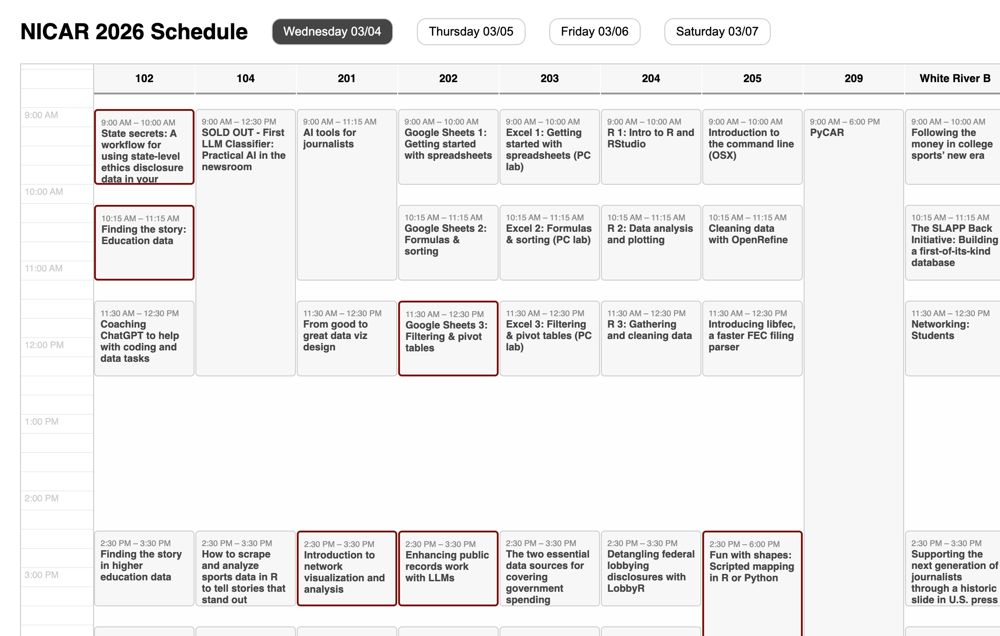
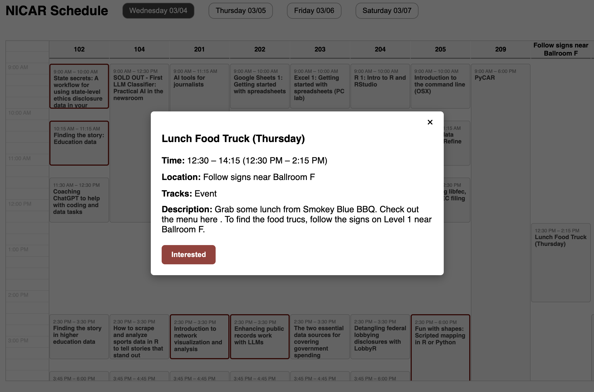

This is based off of \@tylermachado's schedule found here:  https://www.tylermachado.com/nicar-schedule/. I added an interested/not-interested button in vanilla js that then highlights the event.

https://atisor73.github.io/nicar-grid-calendar/

